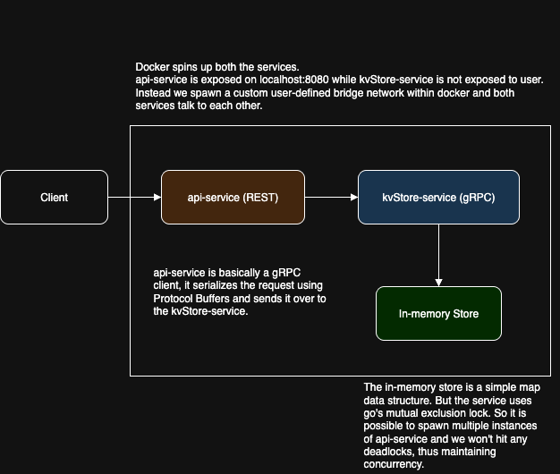

# GRPC-KV-Store-Server


A simple GRPC server that exposes basic CRUD operations on a key-value store using a REST API server

P.S. This is my first time writing in Go, and I built the entire project with it. So pardon me if I didn't use best coding practices here.

## Table of Contents

- [Prerequisites](#prerequisites)
- [How to start the server ?](#how-to-start-the-server-)
- [Testing](#testing)
- [How is all this working ?](#how-is-all-this-working-)
- [Project Structure](#project-structure)

## Prerequisites
- Make sure you got docker and docker compose

## How to start the server ?
- Clone the repo
- Make sure docker is running
- Build the images by running
    - `docker-compose build`
- Now just start the services.
    - `docker-compose up -d`
- That's it !!! You can check the open-api spec of the rest apis at http://localhost:8080/openapi.yaml

### Run individual server manually ?
- Follow along the [Workflows File!](.github/workflows/SystemTests.yml)

## Testing
[](https://www.postman.com/gatechrutvik/rutvik-s-workspace/collection/kmnh7sf/kv-store-api-complete-test-suite?action=share&creator=38345624)

Just hit the button above and you can test out all the APIs.
- Note: You might need Postman Agent to make api calls on localhost

There's one more way. Just run `tests-e2e.sh` file (Won't work on windows)
- Note: You might need to make the script executable first: `chmod +x tests-e2e.sh`

There's also integration tests running on this project for individual services. So any commits to the `main` branch will test both the services out

## How is all this working ?


## Project Structure
```
GRPC-KV-Store-System/
├── api-service/                  # REST API gateway
│   ├── cmd/                      # Main entrypoint
│   │   └── main.go
│   ├── internal/                 # Internal packages
│   │   ├── client/               # gRPC client code
│   │   ├── handler/              # HTTP handlers
│   │   └── middleware/           # OpenAPI validation
│   ├── test/                     # Integration tests
│   ├── Dockerfile                # Container build file
├── kvStore-service/              # gRPC key-value store service
│   ├── cmd/                      # Main entrypoint
│   │   └── main.go
│   ├── internal/                 # Internal packages
│   │   ├── server/               # gRPC server implementation
│   │   └── store/                # In-memory store logic
│   ├── test/                     # Integration tests
│   ├── Dockerfile                # Container build file
├── schemas/                      # Central API contract repository
│   ├── grpc/                     # Protobuf definitions for gRPC
│   │   └── kvStoreService.proto
│   ├── rest/                     # OpenAPI spec for REST API
│   │   └── openapi.yaml
├── test-e2e.sh                   # End-to-end integration test script
├── docker-compose.yml            # Multi-service orchestration
├── README.md                     # Project documentation
```

The docker build process pulls api schemas from the schemas folder. It's a central folder (ideally it should be a separate repo entirely) which both services use. This way both have access to a single source of truth regarding api contracts. While gRPC seamlessly integrates the use of protobuf with itself and its consumers, I had to use a validator middleware for api-service. This helps me validate requests and responses.
